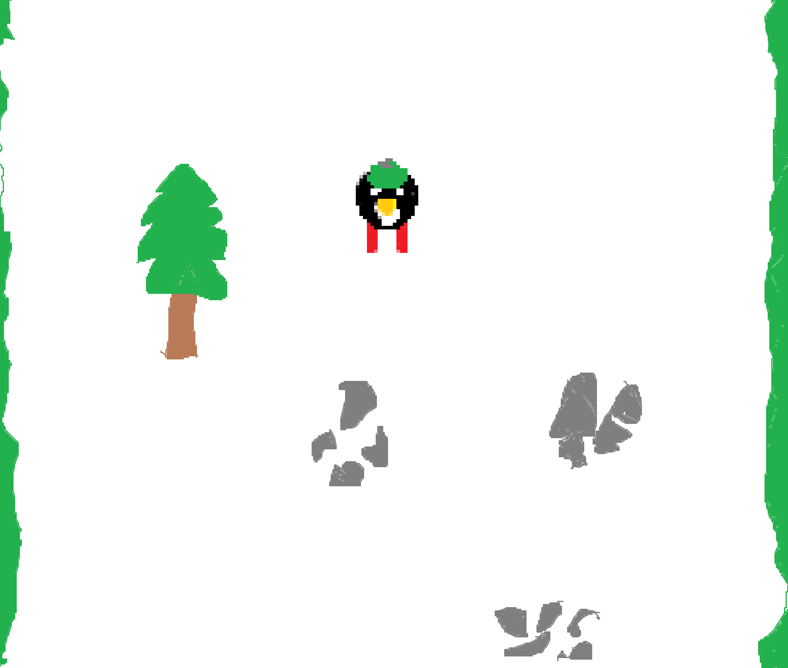
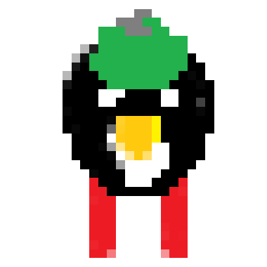
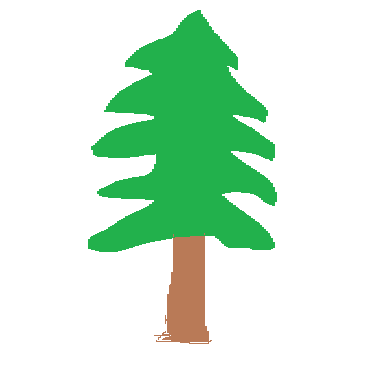

# Harjoitustyön suunnitelma

## Tietoja 

Tekijä: Riku Rönkä

Työ git-varaston osoite: <https://gitlab.jyu.fi/rikantos/ohj1ht> 

Pelin nimi: Pingu laskettelee!

Pelialusta: Windows

Pelaajien lukumäärä: 1

## Pelin tarina

Pingu eksyi lasketellessaan Spring Breakilla, ja joutui vahingossa vaaralliseen rinteeseen, jonka huolto on jäänyt vähäiseksi. 
Matkan varrella on kivikkoa, puita ja erilaisia esteitä, jotka hankaloittavat laskettelua. 
Pingu on hieman kokematon laskettelija, eikä hän osaa hidastaa vauhtiaan kunnolla. 
Pelaajan on ohjattava pingu turvallisesti alas rinteeltä After Skille. 

## Pelin idea ja tavoitteet

Peli toimii scroller pelinä, johon syntyy Pingu-hahmon edelle satunnaisesti esteitä. 
Pingun törmätessä esteeseen, hän menettää yhden sydämen. Sydämiä on pelin alussa kolme kappaletta. Kolmannella törmäyksellä peli päättyy.
Tavoitteena on saataa Pingu maaliin saakka turvallisesti, jotta hän pääsee nauttimaan After Ski -kokemuksesta.

## Hahmotelma pelistä

## Toteutuksen suunnitelma

Helmikuu

- Pingun, sekä esteiden luominen alkeellisesti
- Esteille ja pingulle liikkuminen
- Törmäystenhallinta

Maaliskuu

- Matkalaskuri, sekä maali
- Sydänjärjestelmä Pingulle
- Grafiikkaa

Jos aikaa jää

- Tekoälyllä liikkuvia esteitä
- Kerättäviä lisäsydämiä, jotta matka ei loppuisi kesken
- Mahdollisuus loputtomalle matkalle